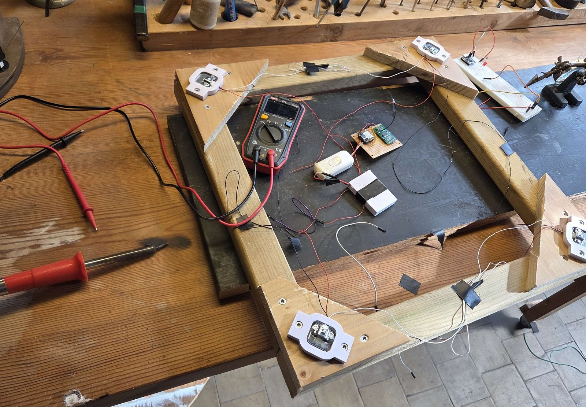
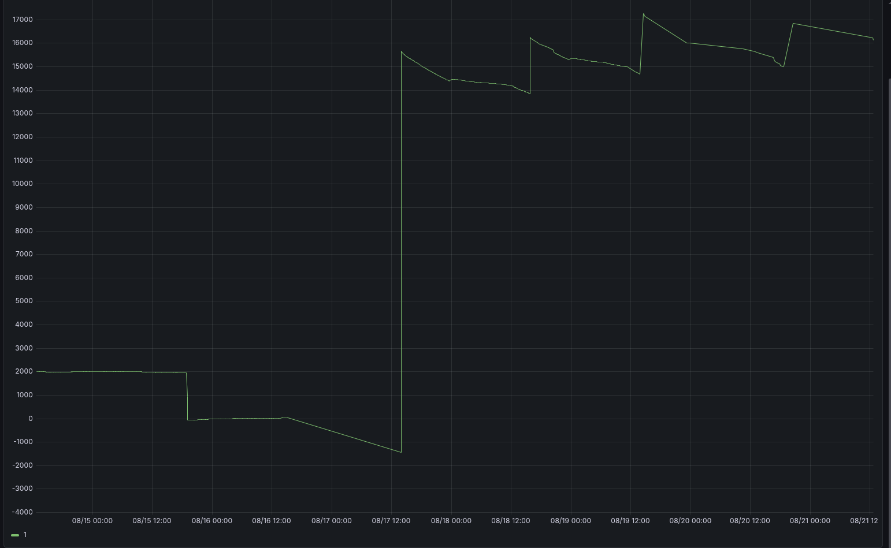
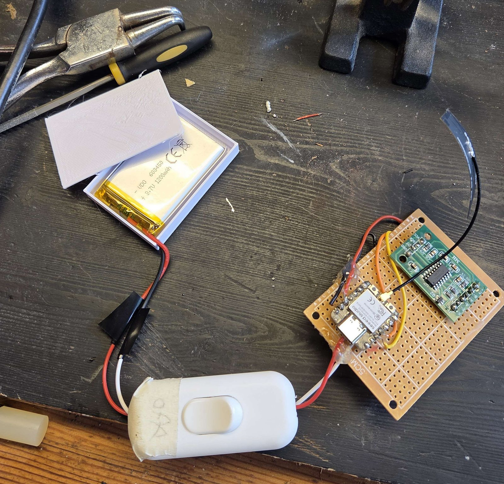
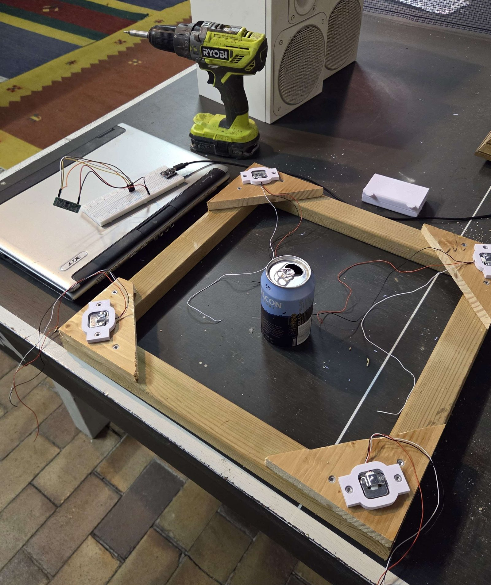

# hive-scale

ESP-IDF firmware for a battery-powered ESP32-C3 hive scale. The project is an
ongoing prototype focused on reliable measurements, offline storage and a
weather-resistant mechanical frame.



*Early bench prototype used to test load distribution across four load cells.*

## System overview

```text
Load cells -> HX711 -> ESP32-C3 -> MQTT -> Node-RED -> InfluxDB -> Grafana
```

The ESP32-C3 reads the load cells through an HX711 amplifier and publishes the
measurements over MQTT. Node-RED receives and routes the data, InfluxDB stores
the time series, and Grafana presents it. The integration implementation saves
measurements to NVS before attempting network communication, so unsent data can
be retained during a connection outage.



*Early test measurements presented in Grafana through the NIG stack.*

## Prototype and testing



*ESP32-C3, HX711 and battery supply assembled for bench testing.*



*Temporary frame and test loads used while evaluating measurement stability.*

The wooden frame is only a test fixture. The next step is a weather-resistant
frame that transfers the hive's full weight through the load cells while
protecting the electronics from moisture.

## Requirements

- Seeed Studio XIAO ESP32-C3 with 4 MB flash
- ESP-IDF 5.5.x (the release workflow uses 5.5.2)
- A 2.4 GHz Wi-Fi network

## Initial setup

OTA release binaries do not contain Wi-Fi credentials. The first local build
seeds credentials into NVS, where subsequent OTA firmware reads them.

1. Copy `main/config.example.h` to the ignored file `main/config.h`.
2. Set `WIFI_SSID` and `WIFI_PASS` in `main/config.h`.
3. Load ESP-IDF 5.5.x in your shell.
4. Build the firmware with `idf.py build`.
5. Connect the board over USB and run `idf.py erase-flash flash monitor`.

The erase is required when moving from the original single-app partition table
to the dual-slot OTA partition table. It also ensures stale PHY data cannot be
mistaken for OTA selection data. Keep `main/config.h` private.

After the first successful boot, the device stores the credentials in the NVS
partition. Normal OTA updates preserve that partition. To replace credentials,
update `main/config.h`, erase flash, and repeat the bootstrap flash.

## OTA behavior

After receiving an IP address, the device checks this HTTPS endpoint:

```text
https://github.com/fransstrom/hive-scale/releases/latest/download/beescale.bin
```

The server certificate is validated with ESP-IDF's trusted certificate bundle.
The image header is fetched first; the full image is downloaded only when its
semantic version is newer than the running firmware. Release versions must use
the `vMAJOR.MINOR.PATCH` format. A completed update is validated, written to the
inactive OTA slot, and booted after a restart.

Bootloader rollback is enabled. A newly installed image is marked valid only
after it starts and receives an IP address. If it resets or enters deep sleep
before that checkpoint, the bootloader restores the previous image. A temporary
Wi-Fi outage during the first boot of a new image can therefore trigger a
rollback by design.

## Check interval

`CONFIG_BEESCALE_OTA_CHECK_INTERVAL_WAKEUPS` controls the interval. It defaults
to `1`, so the current development setup checks on every wake. Because the scale
sleeps for one minute, change this line in `sdkconfig.defaults` for daily checks:

```text
CONFIG_BEESCALE_OTA_CHECK_INTERVAL_WAKEUPS=1440
```

If a local `sdkconfig` already exists, make the same change through
`idf.py menuconfig` or regenerate it before building.

## Publishing firmware

The GitHub repository must be public so devices can download release assets
without embedding a GitHub credential.

The release workflow builds and publishes `beescale.bin` whenever a version tag
is pushed. The tag becomes the firmware version used for update comparisons.

```bash
git tag v0.1.0
git push origin v0.1.0
```

Do not reuse a tag for different firmware. Create a new version tag for every
release, then verify that the GitHub release contains `beescale.bin`.

## Configuration

Project settings are under `BeeScale Configuration` in `idf.py menuconfig`:

- Firmware update URL
- Wake cycles between OTA checks
- Wi-Fi connection timeout

The flash layout uses `ota_0` and `ota_1` application partitions of 1700 KB
each. The application must continue to fit in that limit.
